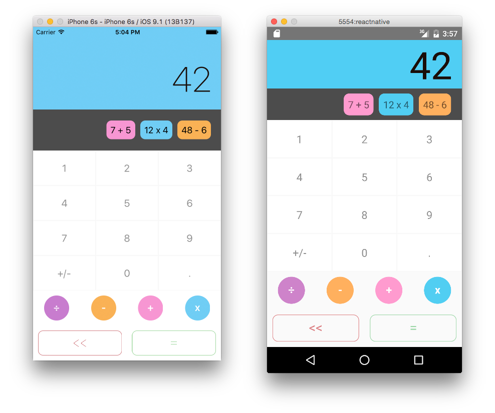
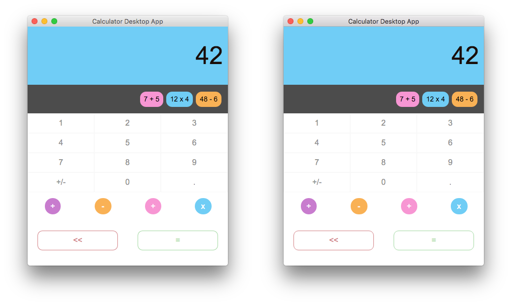
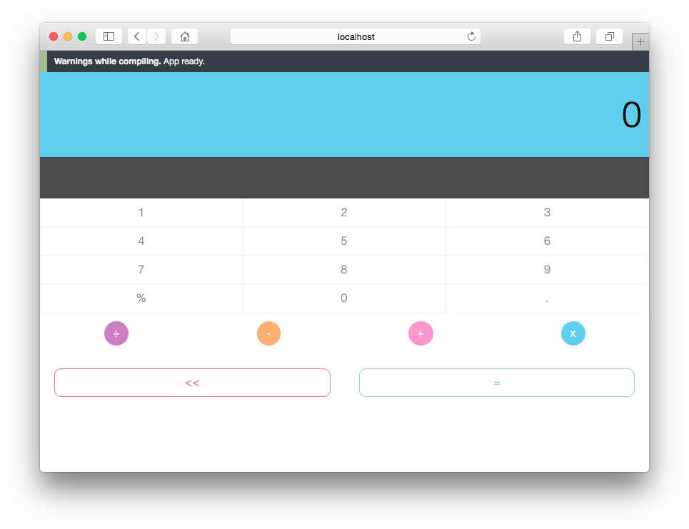
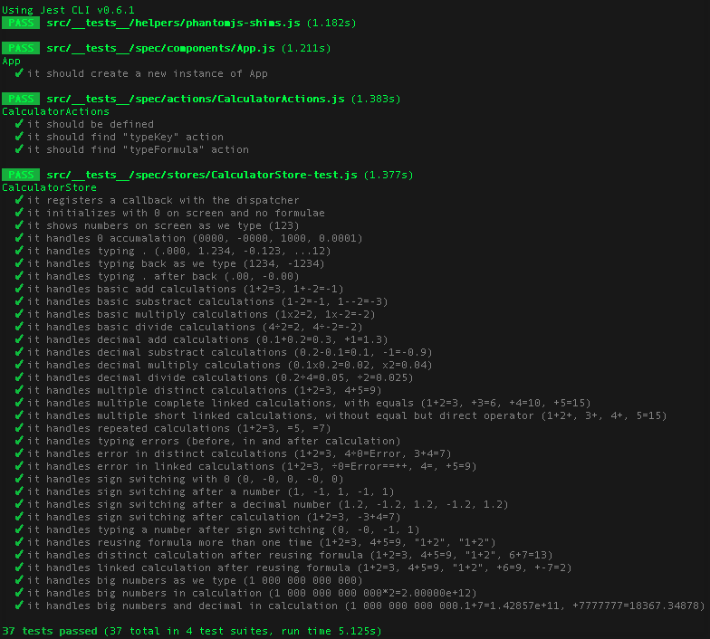

# Mobile, desktop and website Apps with the same code

[](https://travis-ci.org/benoitvallon/react-native-nw-react-calculator) [](https://david-dm.org/benoitvallon/react-native-nw-react-calculator) [](https://david-dm.org/benoitvallon/react-native-nw-react-calculator#info=devDependencies)

This project shows how the source code can be architectured to run on multiple devices. As of now, it is able to run as:

- iOS & Android Apps (based on [react-native](https://facebook.github.io/react-native))
- a Desktop App based on [NW](http://nwjs.io) or based on [Electron](http://electron.atom.io)
- a Website App in any browser (based on [react](https://facebook.github.io/react))

A demo for the Website App is available [here](http://benoitvallon.github.io/react-native-nw-react-calculator).

## Screenshots

### Mobile Apps (iOS & Android)



### Desktop Apps (NW & Electron)



### Website App



## Libraries/tools

This project uses libraries and tools like:
- es6 syntax and [babel](https://babeljs.io)
- [react](https://facebook.github.io/react) for the Website App and Desktop App,
- [react-native](https://facebook.github.io/react-native) for the iOS & Android Apps
- [NW](http://nwjs.io) to package the Desktop App
- [Electron](http://electron.atom.io) to package the Desktop App
- [flux](https://facebook.github.io/flux) to organize the data flow management
- [css-loader](https://github.com/webpack/css-loader) to integrate the styles in the builds
- [grunt](http://gruntjs.com) to create the builds
- [webpack](https://webpack.github.io) to help during the development phase with hot reloading

## Basic philosophy

All the code is contained in the `src` directory, especially the 3 main entry files that are used for the builds:
- `index.ios.js` & `index.android.js` are the ones used to build the iOS & Android Apps
- `index.js` is the one used to build the Website App and Desktop App as the code is strictly the same.

### Flux architecture actions/stores

All the [flux](https://facebook.github.io/flux) architecture is share to 100% to all the different builds. This means that all the logic and data management code is done only once and reuse everywhere. This allows us to have an easy tests suite as well and to ensure that our code is working properly on all the devices.

### Components

The real interest of the project is in how the components have been structured to shared most of their logic and only redefined what is specific to every device.

Basically, every component has a main `Class` which inherits a base `Class` containing all the logic. Then, the main component import a different Render function which has been selected during the build. The file extension `.ios.js`, `.android.js` or `.js` is used by the build tool to import only the right file.

The `.native.js` files contain code that is shared between both mobile platforms (iOS & Android). Currently, the `.ios.js` and `.android.js` files compose this `.native.js` file since all code is shared right now. However, if a component needed to be different for platform specific reasons, that code would be included in the corresponding platform specific files.

At the end, every component is defined by 6 files. If we look at the screen component, here is its structure.

```
Screen.js
├── ScreenBase.js
├── ScreenRender.ios.js (specific to iOS build
├── ScreenRender.android.js (specific to Android build)
├── ScreenRender.native.js (shared mobile app code - iOS & Android)
└── ScreenRender.js (used during Website and Desktop build)
```

And here is the main `Class` file which composes the files.

```js
'use strict';

import Base from './ScreenBase';
import Render from './ScreenRender';

export default class Screen extends Base {
  constructor (props) {
    super(props);
  }

  render () {
    return Render.call(this, this.props, this.state);
  }
}
```

## What's next

Here are some thoughts about what can come next:

- Make the Website App Isomorphic/Universal

## Thank you Robert for your awesome design

I want to thank Robert O'Dowd who kindly authorized me the reuse his very beautiful design. The original design made by Robert was part of his project called "Simplifycation" visible [here](https://dribbble.com/shots/1973851-Simplifycation).

# How to build/run the projects

## General requirements before running any specific project

- `npm install` to install all the dependencies, React and React Native among others.

### With some versions of npm (>=v3.3.10 <=v3.6.0)

Some builds from npm included bugs while `npm install`. So if you are using a npm version within the range form 3.3.10 to 3.6.0 included, you must run `npm install` twice. Those versions including npm v3.3.12 are the ones bundled by default with node from version v5.1.0 to v5.5.0.

- `npm install npm`
- `npm install npm` run it twice, because of the packages won't be installed after the first run [#10985](https://github.com/npm/npm/issues/10985)

## The Mobile Apps (iOS & Android)

### Requirements for React Native

#### iOS

- OS X
- Xcode 6.3 or higher is recommended (Xcode only runs on Mac).
- Homebrew is the recommended way to install node, watchman, and flow.
- `brew install node`
- `brew install watchman`. We recommend installing watchman, otherwise you might hit a node file watching bug.
- `brew install flow`. If you want to use flow.

#### Android

- Follow the official documentation guide here: http://facebook.github.io/react-native/docs/getting-started.html#android-setup (includes experimental Windows & Linux support)

### Running the Mobile Apps

#### iOS

- Open iosApp.xcodeproj and hit run in Xcode.
- Hit cmd+R in your iOS simulator to reload the app and see your change!

#### Android

- Open an emulator. (Genymotion or run `android avd`)
- Run the `react-native run-android` in the root of this project.
- If trying to run on a device, read the following guide: http://facebook.github.io/react-native/docs/running-on-device-android.html#content

Congratulations! You've just successfully run the project as an iOS or Android App.

## The Website App

### Requirements for React

There isn't any additional requirements since you already installed the deps with `npm install`.

### Quick start

- `npm run build` to build the project (at least the first time)
- `npm run serve-web` to preview in the browser at http://localhost:8000/index.web.html or http://localhost:8000/webpack-dev-server/index.web.html with webpack-dev-server and hot reload enabled

Congratulations! You've just successfully run the project as a Website App.

## The Desktop App

You can either run the project with [NW](http://nwjs.io) or [electron](http://electron.atom.io).

### Requirements for NW

To run the project, you are supposed to run something like:

`/path/to/nw .`

On OSX, the executable binary is in a hidden directory within the .app file. The easier solution to install it is to download the app on http://nwjs.io/ then copying it to your application folder. You will now be able to run:

`/Applications/nwjs.app/Contents/MacOS/nwjs .`

You can also setup an alias to call the binary.

`alias nw="/Applications/nwjs.app/Contents/MacOS/nwjs"`

### Quick start with NW

- `npm run build` to build the project (at least the first time)
- `npm run serve-nw` to launch the desktop app and enable livereload

Congratulations! You've just successfully run the project as a Desktop App.

### Quick start with Electron

- `npm run build` to build the project (at least the first time)
- `npm run serve-electron` to launch the desktop app and enable livereload

Congratulations! You've just successfully run the project as a Desktop App.

# Run the tests

To run the tests, simply run:

```
npm test
```


